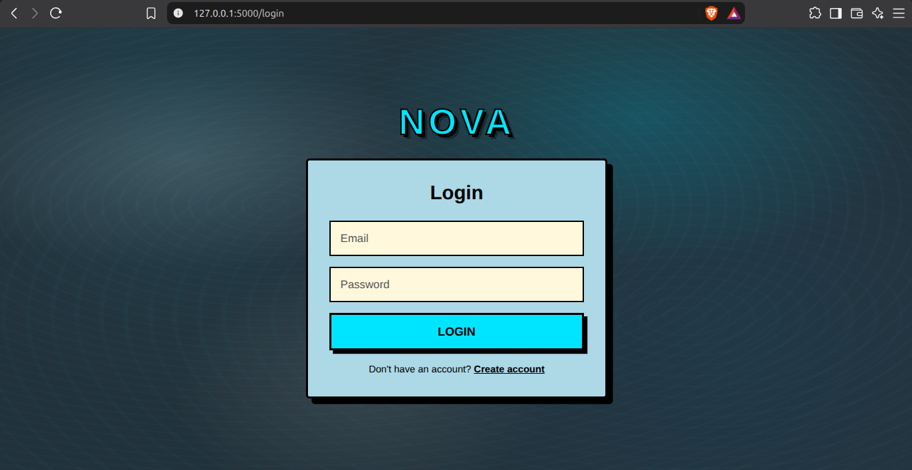
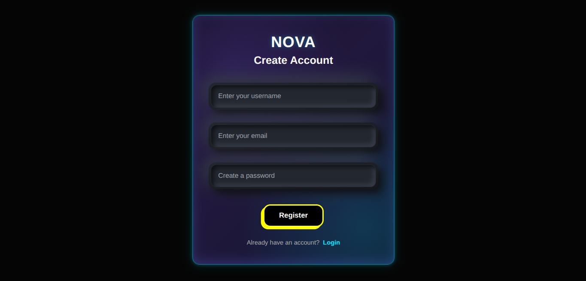
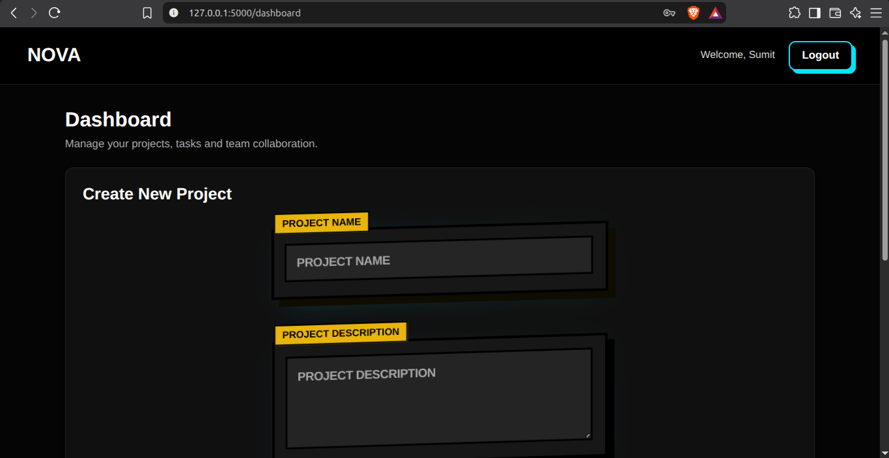
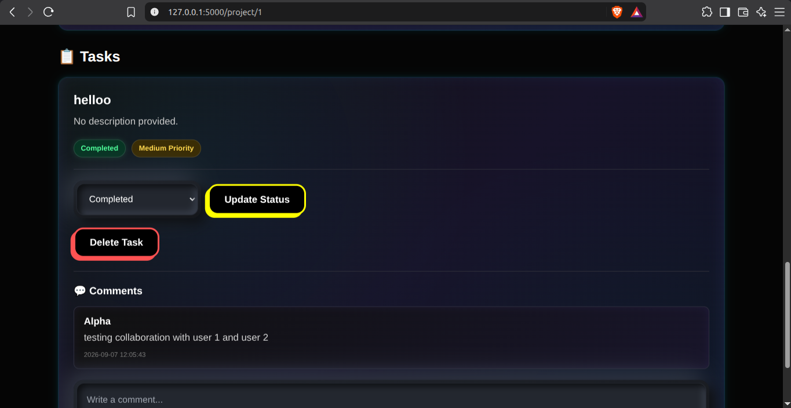

# NOVA – Project Management Application

NOVA is a full-stack project management web application designed to help teams create and manage projects, organize tasks, collaborate with members, and track project progress from a centralized dashboard.

## Features

* User registration and login
* Session-based authentication
* Create and manage projects
* Add members to projects
* Create and assign tasks
* Update task status
* Delete tasks
* Add comments for collaboration
* Project owner and member access control
* Project dashboard with progress tracking
* Secure logout with cache protection
* IST-based project creation timestamps
* SQLite database for persistent data storage
* Responsive web interface

## Technologies Used

### Frontend

* HTML5
* CSS3
* JavaScript
* Jinja2 Templates

### Backend

* Python
* Flask

### Database

* SQLite

### Development Tools

* Git
* GitHub
* Python Virtual Environment

## Project Structure

```text
project-management-app/
│
├── app.py
├── requirements.txt
├── README.md
├── .gitignore
│
├── pic/
│   ├── login.png
│   ├── registration.png
│   ├── dashboard.png
│   ├── dashboard 2.png
│   ├── project 1.png
│   └── tasks.png
│
├── static/
│   └── ...
│
└── templates/
    ├── dashboard.html
    ├── login.html
    ├── project.html
    └── register.html
```

## Screenshots

### 1. Login Page



### 2. Registration Page



### 3. Dashboard




### 4. Project Management Page


### 5. Task and Collaboration Section



## How to Run the Project Locally

### 1. Clone the repository

```bash
git clone https://github.com/Sumit2404/project-management-app.git
cd project-management-app
```

### 2. Create a virtual environment

```bash
python3 -m venv venv
```

### 3. Activate the virtual environment

```bash
source venv/bin/activate
```

### 4. Install the required dependencies

```bash
pip install -r requirements.txt
```

### 5. Run the Flask application

```bash
python3 app.py
```

### 6. Open the application

Open your browser and visit:

```text
http://127.0.0.1:5000
```

## Authentication and Access Control

NOVA uses Flask sessions for user authentication.

Different actions are controlled according to the user's role within a project:

* Project owners can create tasks and add members.
* Task owners can update and delete their tasks.
* Project members can participate in project collaboration.
* Users can only access projects they own or are members of.

## Database

NOVA uses SQLite for persistent data storage.

The application stores information related to:

* Users
* Projects
* Project members
* Tasks
* Comments

The database is maintained locally by the application.

## Project Objective

The objective of NOVA is to provide a simple and functional platform for managing team projects and tasks while demonstrating full-stack development concepts such as:

* Frontend development
* Backend development
* REST-style routes
* Database management
* Authentication
* Session management
* Access control
* CRUD operations
* Git and GitHub workflow

## Future Improvements

Potential future improvements include:

* Real-time notifications
* Email notifications
* Advanced task filtering and search
* Project deadlines and reminders
* File attachments
* User profile management
* Improved mobile responsiveness
* Deployment to a cloud platform

## Author

**Sumit**

Built as a Full Stack Development project and internship assignment.

## Repository

GitHub: https://github.com/Sumit2404/project-management-app

